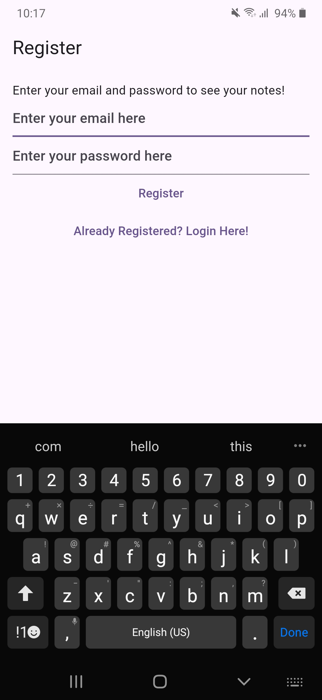
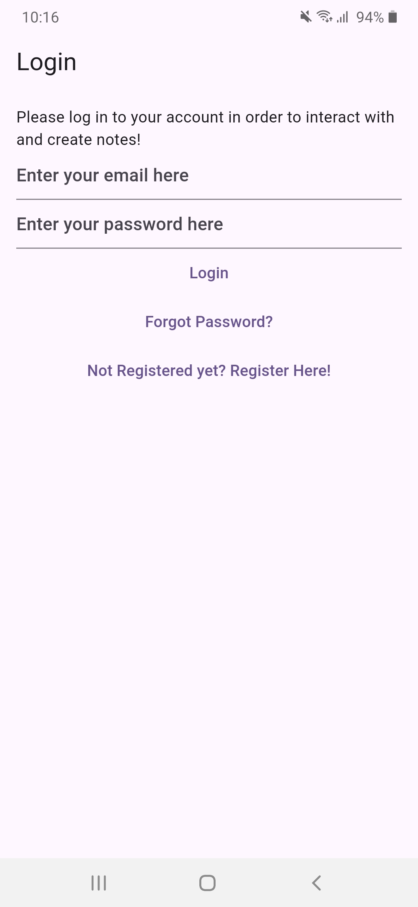
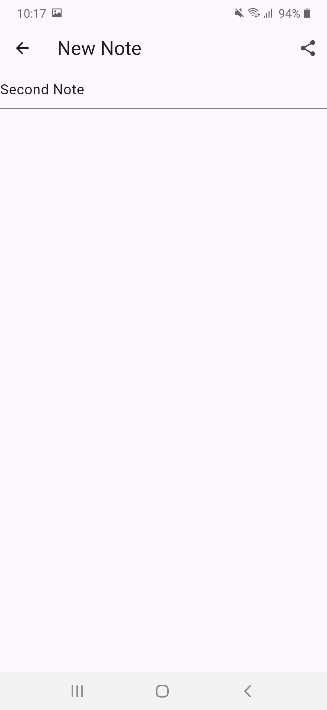
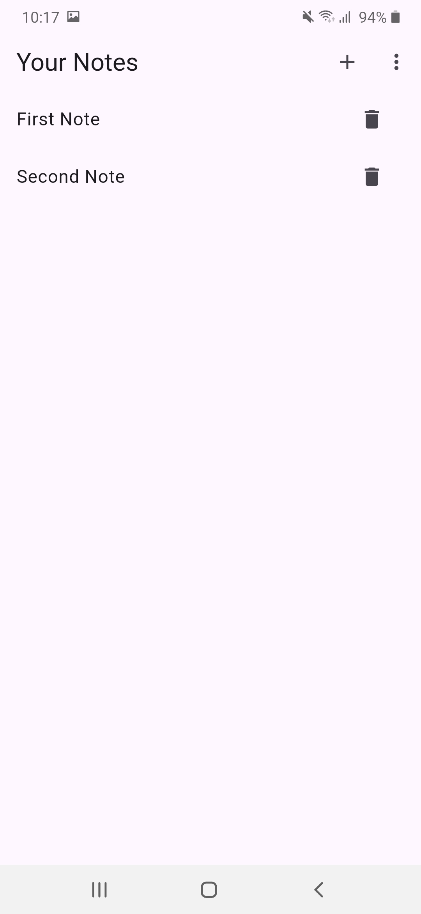

# MyNotes

**MyNotes** is a simple and efficient note-taking app built using **Flutter**. It allows users to securely create, edit, and manage their notes. The app supports features like user authentication, password reset, email verification, and the ability to share notes with others.

## Features

- **User Authentication**
  - Login using email and password
  - Logout securely
  - Reset password via email
  - Send email verification link for account validation

- **Notes Management**
  - Create new notes
  - Edit existing notes
  - Delete notes
  - Share notes with others

## Screenshots

| Register Screen | Login Screen | Create Note | Notes List |
|------------------|--------------|-------------|-------------|
|  |  |  | 


## Installation

To run **MyNotes** locally, follow these steps:

### Prerequisites

Ensure that you have the following installed on your machine:

- [Flutter SDK](https://flutter.dev/docs/get-started/install)
- [Dart](https://dart.dev/get-dart)
- An IDE such as [Android Studio](https://developer.android.com/studio) or [VS Code](https://code.visualstudio.com/) with Flutter extension

### Clone the Repository

```bash
git clone https://github.com/iPriyanshu19/MyNotes.git
cd MyNotes
```

### Install Dependencies

```bash
flutter pub get
```

### Run the App

To run the app on an emulator or a physical device, use the following command:

```bash
flutter run
```

## Firebase Integration

The app uses Firebase for authentication and storing notes. Make sure to set up Firebase for the project:

1. Create a Firebase project [here](https://console.firebase.google.com/).
2. Add Android/iOS apps to the Firebase project.
3. Download the `google-services.json` (for Android) or `GoogleService-Info.plist` (for iOS) and place them in the respective directories in your Flutter project.
4. Configure Firebase in `pubspec.yaml`:
   ```yaml
   dependencies:
     firebase_core: ^3.4.0
     firebase_auth: ^5.2.0
     cloud_firestore: ^5.3.0
   ```

5. Initialize Firebase in `main.dart`:

   ```dart
   void main() async {
     WidgetsFlutterBinding.ensureInitialized();
     await Firebase.initializeApp();
     runApp(MyNotesApp());
   }
   ```

## App Architecture

The app follows the **BLoC (Business Logic Component)** architecture to separate business logic from the UI. Here's a brief overview:

- **Model**: Defines the structure of data like notes.
- **View**: Responsible for the UI and displaying notes.
- **BLoC**: Handles all the business logic and manages states between the UI and data layers.

## Contribution

Contributions are welcome! Please create a pull request or open an issue if you encounter any bugs or have suggestions for improvement.

## License

This project is licensed under the MIT License - see the [LICENSE](LICENSE) file for details.
